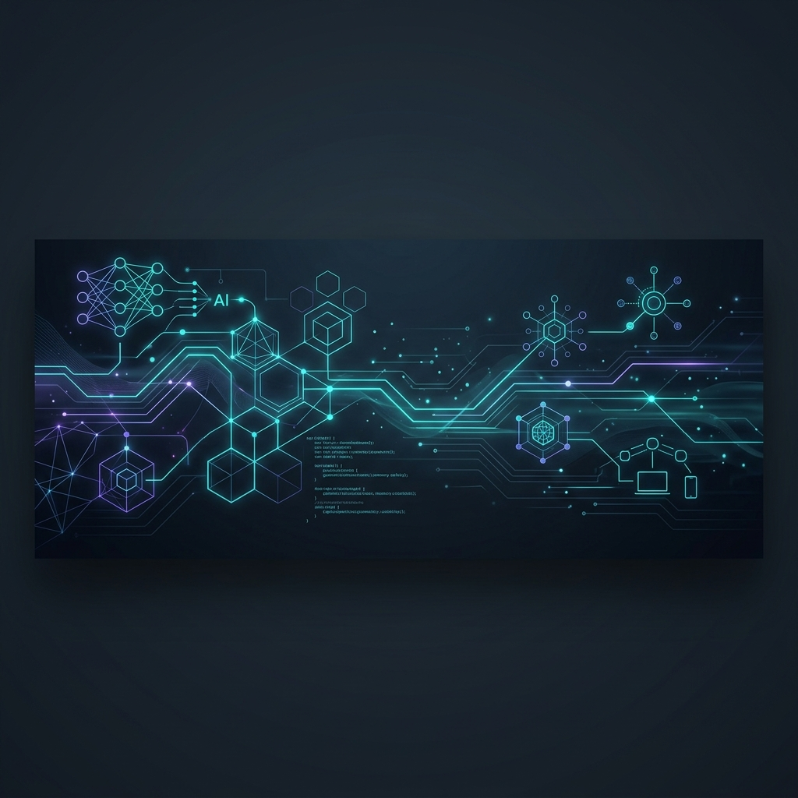

  

<h1 align="center">Hi there, I'm Mohamed Satti 👋</h1>

  <b>Computer Engineering Student | AI Systems & Edge AI Researcher | Backend Engineer</b>

  
  
  

---

### 🚀 About Me

I am a driven **Computer Engineering** student and **IEEE-published researcher** specializing in local-first AI architectures, agentic pipelines, and real-time AI at the edge. I have a strong passion for designing privacy-preserving, high-performance systems and robust backend architectures.

Currently, I am developing advanced AI orchestrators in **Rust**, custom edge intelligence pipelines on **NVIDIA Jetson** platforms, and fine-tuning deep learning models for domain-specific NLP applications. 

* 🎓 **Education:** B.Sc. in Computer Engineering @ Atılım University (GPA: **3.80/4.00**)
* 🔬 **Research Focus:** LLM Reasoning, Chain-of-Thought (CoT) evaluation paradigms, and agentic workflows.
* 🤖 **Leadership:** HRI (Human-Robot Interaction) Team Lead & Project Mentor at **Atılım Robotics Society**.
* 🔒 **Core Philosophy:** Building secure, local-first architectures that preserve privacy and run efficiently on resource-constrained devices.

---

## 🛠️ Tech Stack

<table width="100%">
  <tr>
    <td valign="top" width="33%">
      <h4>💻 Languages</h4>
       
       
       
       
       
       
      
    </td>
    <td valign="top" width="33%">
      <h4>🧠 AI & Systems</h4>
       
       
       
       
      
    </td>
    <td valign="top" width="33%">
      <h4>⚙️ Backend & DBs</h4>
       
       
       
      
    </td>
  </tr>
</table>

---

## 🛡️ Featured Projects

### 🌟 **AEGIS — Privacy-Preserving Local Orchestration Agent**
*A local-first, offline AI assistant and task orchestrator designed to maintain total privacy while offering rich LLM capabilities.*
- **Rust Engine Core:** Powered by a high-performance multi-threaded orchestrator (`aegis-engine`) that handles tool registries and schedules pipelines with minimal overhead.
- **Local-First RAG Subsystem:** High-speed semantic search, text extraction, and offline document vector indexing.
- **Model Context Protocol (MCP):** Standards-compliant MCP tool runner for secure, extensible integrations with local applications (e.g., Zotero, Semble, and local file systems).
- **Offline Voice Pipeline:** Integrated offline STT (Speech-to-Text via `faster-whisper`) and TTS (Text-to-Speech via `piper-tts`) running entirely on-device.
- **Tech Stack:** `Rust` `Python` `RAG` `Ollama` `MCP` `faster-whisper` `piper-tts`

### 📹 **Edge-Based Real-Time Dataset Generation Pipeline (LAP)**
*A research-focused computer vision and labeling pipeline deployed on Edge hardware for low-latency dataset engineering.*
- **Multi-Camera Capture:** Implemented a robust multi-camera capture and selection system using DirectShow (`CAP_DSHOW`) optimized for Windows/Linux.
- **Optimized Edge Inference:** Low-latency real-time object detection, annotation workflows, and segmentation on **NVIDIA Jetson** devices using optimized **YOLOv8** weights.
- **Automated Augmentation:** Instant edge-side image augmentation and bounding box adjustment to accelerate model training cycles.
- **Performance Diagnostics:** Integrated an on-device metrics dashboard tracking real-time inference latency, frame rates, and system resources.
- **Tech Stack:** `Python` `OpenCV` `YOLOv8` `NVIDIA Jetson` `Edge AI` `DirectShow`

### 🧬 **Medical Domain GPT-2 Fine-Tuning**
*End-to-end domain adaptation and fine-tuning of GPT-2 (124M) models on specialized medical literature.*
- **Phase 1: Baseline Evaluation:** Formulated evaluation benchmarks to test out-of-the-box performance on specialized medical QA.
- **Phase 2: Continued Pre-Training (CPT):** Injected medical vocabulary and clinical concepts by pre-training on PubMed corpora.
- **Phase 3: Sequence Classification (SC):** Tuned sequence classifiers for domain-specific categorization and metadata indexing.
- **Phase 4: Instruction Fine-Tuning (IFT):** Enhanced clinical reasoning and QA generation via instructional dataset alignment.
- **Tech Stack:** `Python` `PyTorch` `Transformers` `Hugging Face` `NLP` `PubMed`

---

## 🔬 Research & Publications

### 📄 **[LLMs’ Challenge with Riddles: A Comparative Chain-of-Thought Reasoning Study](https://doi.org/10.1109/IISEC69317.2026.11418442)**
> 🏛️ **Published in:** *2026 5th International Informatics and Software Engineering Conference (IISEC)* — **IEEE**
> 🔗 **DOI:** [`10.1109/IISEC69317.2026.11418442`](https://doi.org/10.1109/IISEC69317.2026.11418442)
> 
> **Key Focus:**
> A comparative investigation into the logical boundaries of large language models. This research benchmarks model performance across several prompting paradigms, evaluating how changes in **Chain-of-Thought (CoT)** structures affect accuracy, reasoning steps, and cognitive failure modes on non-linear logical tasks and riddles.

---

## ⚡ Currently Exploring

- 🧠 **Agentic AI systems & Multi-Agent Orchestration**
- 🏎️ **Local inference optimization & model quantization**
- 🛠️ **Developer-first AI tooling infrastructure**
- 📡 **Real-time Edge AI deployment (NVIDIA Jetson)**
- 🧪 **RAG evaluation pipelines & LLM reliability scoring**
- 🦀 **Rust for high-performance AI engines**

---

## 📈 GitHub Metrics

  
  

---

## 🎯 Core Philosophy

> "Build practical intelligent systems that run efficiently, privately, and reliably."

---

## 🤝 Connect With Me

  
  
  

